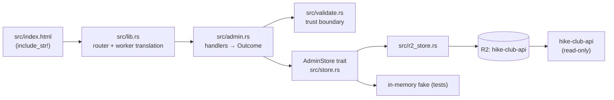

# High-Level Design: hike-club-admin

## Problem

Hike records in the `hike-club-api` R2 bucket are hand-edited JSON with no
admin surface: scheduling or correcting a hike means editing an R2 object
directly.

## Approach

A single-page admin tool, served by a Rust Cloudflare Worker, that is the only
writer to the `hike-club-api` bucket. It reads the same objects the public API
reads, and validates every write at one trust boundary (`src/validate.rs`) so
nothing reaches the bucket that the public API cannot deserialize.

## Target Users

A single club admin, browsing from the club's timezone, on a desktop browser
behind Cloudflare Access.

## Goals

*(not yet specified — elicit before the next HLD-level change.)*

## Non-Goals

- No authentication code in this repo — Cloudflare Access rejects
  unauthenticated requests before the Worker runs.
- No database, no bundler, no framework, no static-assets binding.
- No multi-user or multi-club support.
- No hike date or time. The app sends each hike's window as query parameters
  when it fetches trail info; the stored record carries no date, and this
  repo has no view of when a hike is.

## Tenets

- Presentation is hand-rolled. Prefer native CSS and system fonts over a UI
  framework or a hosted asset, even where the framework would be faster to
  adopt.

## System Design

- `src/validate.rs` is the trust boundary; slugs must name a known location, and
  the location mapping doubles as the allowlist of R2 keys this worker may write.
- `id` and `mapKey` are derived from the path slug, never read from a body.
- Handlers return `Outcome` (status + serialized body) so they stay runtime-free
  and testable; `lib.rs` only translates to `worker::Response`.
- `AdminStore` is the test seam — a byte-blob trait shaped like R2.

## Key Design Decisions

| Decision | Alternatives considered | Why |
|---|---|---|
| Hand-rolled slug matching, no `regex` crate | `regex` | One pattern does not justify the wasm binary bloat. |
| `AdminStore` byte-blob trait | Test against real R2 | Keeps handler logic pure and covered; `R2Store` becomes pure translation. |
| `openapi.yaml` as the contract, asserted in `tests/contract.rs` | Docs-only spec | Spec limits, rejected bodies, and router paths are all held equal to the code, so they cannot drift. |
| Auth lives in Cloudflare Access, not in code | API key / session handling | Access rejects before the Worker runs; identity arrives as `Cf-Access-Authenticated-User-Email`. |

## Success Metrics

*(not yet specified — elicit falsification signals before the next HLD-level change.)*

## References

- `openapi.yaml` — the contract; `tests/contract.rs` holds the code to it.
- `../hike-club-api` — the public read-only API; `src/models.rs` there
  deserializes the exact bytes `HikeRecord` writes.
- `../hike-club-app` — the iOS app that consumes the public API.
